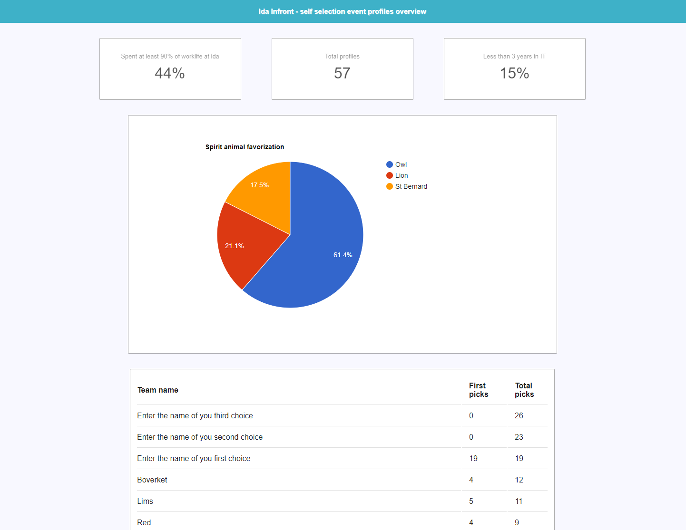

# Self selection dashboard

- Show the distribution of team preference, maybe your team needs a boost?
- Visualize the distribution of spirit animals, do we need more gryphons?
- Keep a count of the total cards created and some mysterious extra stats!
- The charts are updated in near- realtime.

Python 3.6+, asyncio/aiohttp and the Jira REST API.



### Installation

```console
docker build .
docker run <image> -it -p 4040:8080
```

or just ..

```console
pip install bs4 lxml aiohttp
python main.py
```